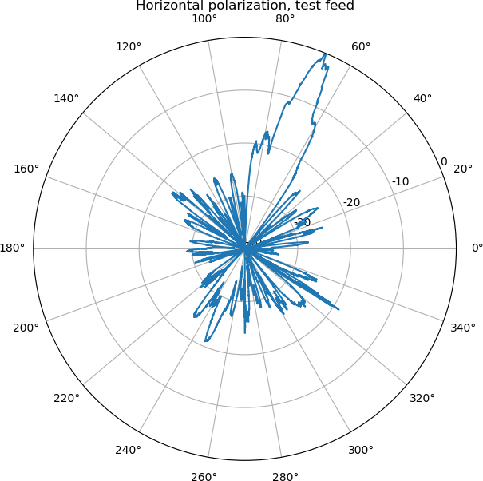

Scripts, Python modules and GNU Radio companion examples for measuring the
reception power of an antenna during rotation, and for doing the necessary
off-line analysis to produce antenna diagrams.

The code here is described in a blog post, https://www.la1k.no/?p=2579.

Use `rotctld_angle_printer.py` to print timestamp + angle to file. See
docstring of `rotctld_angle_printer.py` for more details. Let this run
continuously while collecting GNU Radio samples and turning the rotor.

Run grc_uhd_to_iq.grc in GNU Radio companion to collect IQ samples for later
power spectrum estimation, or run grc_uhd_to_power_spectrum.grc to estimate
power spectra directly for selected FFT bins.

Use `combine_samples_and_angles.py` to combine samples/power estimates produced
using GNU Radio with the above angle measurements.  See docstring of
`combine_samples_and_angles.py` for more details.
